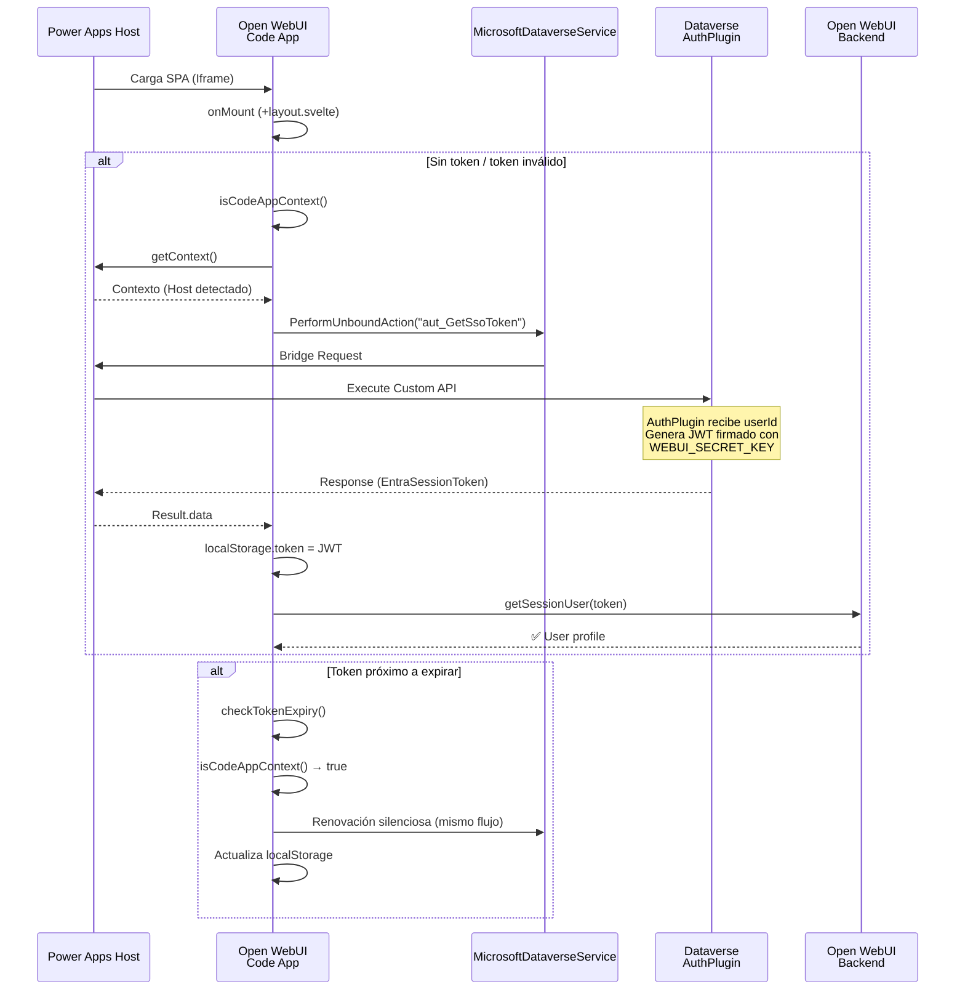

# CRM Auth Integration — Walkthrough

## Qué se implementó

Autenticación transparente para el Open WebUI Code App: cuando el frontend corre dentro de Power Apps, obtiene un JWT de Dataverse sin que el usuario vea una pantalla de login. Esto permite que la aplicación embebida herede la identidad del usuario de CRM.

## Archivos modificados

### [NEW] [crmAuth.ts](file:///src/lib/powerapps/services/crmAuth.ts)

Servicio principal que maneja la detección del contexto y la obtención del token.

1.  **`isCodeAppContext()`**: Utiliza `@microsoft/power-apps` SDK (`getContext`) con un timeout para detectar si la app está corriendo dentro del player de Power Apps.
2.  **`requestCrmToken()`**: Invoca a la Custom API `aut_GetSsoToken` utilizando `MicrosoftDataverseService`.
3.  **Gestión de variables**: Utiliza `CRM_BASE_URL` inyectada en build-time para apuntar al entorno correcto.

## Arquitectura



## Flujo de Datos

### 1. Detección de Contexto (`isCodeAppContext`)

Verificamos si estamos en un iframe y si el SDK de Power Apps responde.

```typescript
export async function isCodeAppContext(): Promise<boolean> {
    if (typeof window === 'undefined') return false;
    if (window === window.parent) return false;

    try {
        // Race condition: si no responde en 1s, asumimos que no es Code App
        const ctx = await Promise.race([
            getContext(),
            new Promise<null>((_, reject) => setTimeout(() => reject(new Error('Timeout')), 1000))
        ]);
        return !!ctx;
    } catch {
        return false;
    }
}
```

### 2. Llamada a Custom API (`requestCrmToken`)

Utilizamos el servicio generado para invocar la acción en Dataverse.

```typescript
const result = await MicrosoftDataverseService.PerformUnboundActionWithOrganization(
    CRM_BASE_URL, // Inyectado por Vite (define)
    CRM_CUSTOM_API_NAME // 'aut_GetSsoToken'
);

const data = result.data;
// El plugin retorna el token en la propiedad EntraSessionToken
const entraToken = (data?.EntraSessionToken ?? data?.entraSessionToken);
```

### 3. Integración en Frontend (`+layout.svelte`)

- **Inicio**: En `onMount`, si no hay sesión válida, se intenta `attemptCrmAuth()`.
- **Sesión Activa**: `checkTokenExpiry` monitorea la validez del token.
- **Renovación**: Si está por expirar y es contexto Code App, renueva el token silenciosamente sin redirigir al login.

## Configuración Requerida

### Frontend
- `.env`: `CRM_BASE_URL` (o fallback en `vite.config.ts`)
- Variable Global: `CRM_BASE_URL` definida en `src/app.d.ts`

### Backend (Open WebUI)
- `WEBUI_SECRET_KEY`: Debe coincidir con la key usada por el AuthPlugin de Dataverse para firmar los tokens.
- `CORS_ALLOW_ORIGIN`: Debe incluir la URL del frontend (ej. `http://localhost:5173`) para permitir la carga de assets estáticos (favicons) con credenciales.


## Gestión de Contexto (Carpetas)

El frontend permite iniciar la aplicación en el contexto de una carpeta específica (por ejemplo, para separar chats por registro de CRM).

### Parámetros URL

La aplicación escucha los siguientes parámetros en la query string:

-   **`folder_id`** (Requerido): ID único de la carpeta (ej. GUID del registro de CRM).
-   **`folder_name`** (Opcional): Nombre visible de la carpeta.

### Comportamiento (`CrmContextService.ts`)

1.  **Validación**: Si no existe `folder_id` en la URL, se ignora el contexto.
2.  **Búsqueda**: Se busca una carpeta existente con ese ID exacto.
3.  **Creación**: Si no existe, se crea una nueva carpeta:
    -   **ID**: Se fuerza el `id` de la carpeta al valor de `folder_id`.
    -   **Nombre**: Se usa `folder_name`. Si no se provee, se usa el `folder_id`.

### Ejemplo de URL en Power Apps

Para pasar estos parámetros correctamente desde Power Apps (donde la URL de la app está embebida en `_localAppUrl`), es crucial **codificar la URL interna**:

```
https://apps.powerapps.com/...
  ?_localAppUrl=http%3A%2F%2Flocalhost%3A5173%3Ffolder_id%3D<GUID>%26folder_name%3D<NAME>
```

**Nota**: El carácter `&` que separa `folder_id` y `folder_name` debe ser enviado como `%26` para que Power Apps no lo interprete como un parámetro propio.
