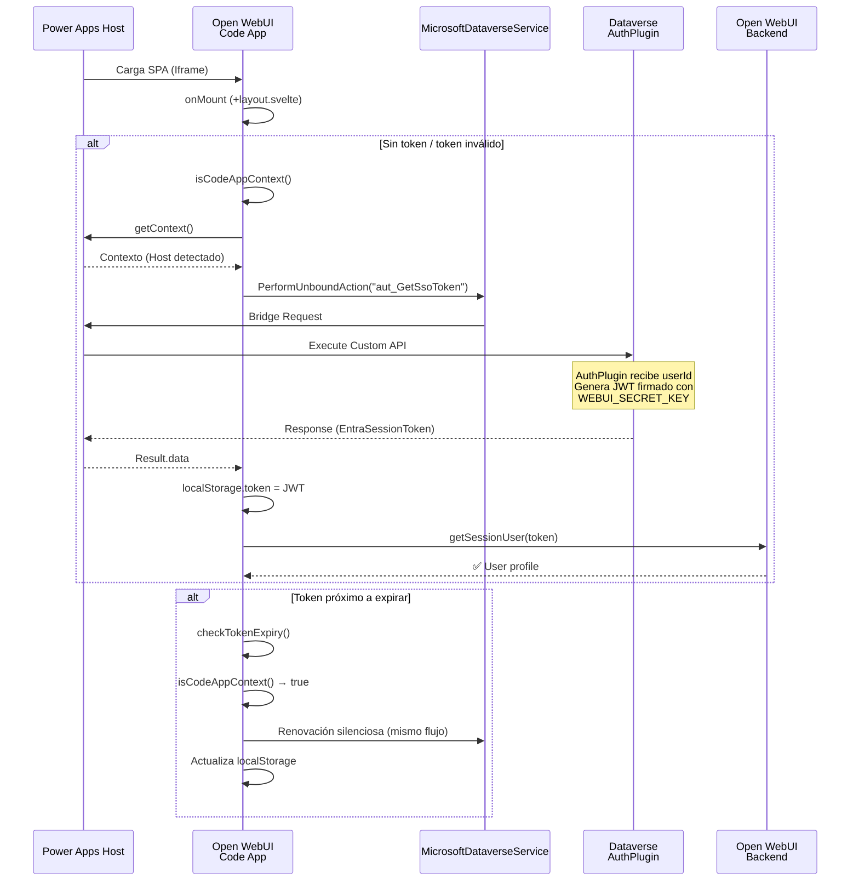

# CRM Auth Integration & Embedded Experience — Source of Truth

## Objetivo General
Crear un Asistente de Inteligencia artificial destinado a asistir orientadores vocacionales a orientar a los usuarios.
Actualmente el equipo de orientadores trabaja en Dynamics 365 CRM, donde tiene informacion historica del usuario (tabla 'contact' dataverse) 
Se busca integrar un widget de chat en el crm que permita al orientador hablar con el asistente directamente desde el crm.
El asistenten debe ser capaz de conocer en tiempo real la informacion del usuario que se esta entrevistando.
Para esto, estamos apoyandonos en un fork propio del proyecto Open Source Open-webui y buscamos integrarlo en un chat widget a Dynamics  365.

## Contexto del Proyecto
Realizamos un fork de Open WebUi en la carpeta src/web/open-webui
Inicializamos Power Apps Code App con pac code init en el repositorio.
Estamos trabajando en la integracion crm -> Open Web Ui.
Para embeber el chat en el crm, estamos utilizando la api de javascript de la model driven app, para crear un side Panel y navegar dentro de el a un webresource llamado iframe bridge.
Este iframe bridge recibe la url y la setea en un iframe.
Por ahora es su unica funcionalidad, pero se descubrioo que puede acceder a Xrm.Page a traves de parent.Xrm.Page, cosa que es bastante util ya el src de nuestro iframe es cross origin, y por otro lado el javascript de las model driven app se carga por formulario.
Estas 2 cosas hacen que nuestro iframe bridge sea muy coveniente para comunicarse con nuestro iframe via post message para funcionalidades futuras, ya que estara disponible en el contexto global de la app mientras viva el side panel.
Por ello, se crearon varios servicios junto con el js que abre el side panel.
Esto esta en powerapps/js/src
si bien el file hace referencia a contact command bar, como te digo actualemtne se esta usando para escribir boilerplate que necesitaremos.


# Features

## Feature 1: powerapps/js/src/ChatCommands.js 

**Descripción:**  
Cuando un usuario toca el boton de abrir chat en el crm, se ejecuta la funcion newChat() de ChatCommands.js
La misma navega al web resource que tiene el html con el iframe para mostrar el chat de open web ui, y la logica js para inyectar el contexto del crm.

### Implementación

**Estado:** Completo

**Detalle Técnico:**
```javascript
newChat() {
    const existingPane = this.paneService.getPane(this.CHAT_PANEL_NAME);
    if (existingPane) {
        console.log("Chat pane already open");
        existingPane.select();
        return;
    }

    this.paneService.createPane({
        title: "Chat",
        paneId: this.CHAT_PANEL_NAME,
        canClose: true,
        width: 400,
        alwaysRender: true,
    }).then(pane => {
        pane.navigate({
            pageType: "webresource",
            webresourceName: this.CHAT_BRIDGE_RESOURCE_NAME,
            data: JSON.stringify({
                url: this.CHAT_BASE_URL
            })
        });
    }).catch(error => {
        console.error("Error creating chat pane:", error);
        this.navigationService.openErrorDialog({
            message: "Error creating chat pane",
            details: error.message,
        });
    });
}
```

## Feature 2: Iframe Web resource carga el iframe de open-webui

**Descripción:**  
Este iframe tiene acceso al Xrm object de la api de cliente de js de model driven a partir de parent.Xrm
Ademas se encuentra en el mismo dominio de power apps.
ademas este webresource lo estamos cargando en un side panel, por ende esta disponible globalmente en toda la app
esto lo hace un lugar perfecto para controlar el chat e inyectar el contexto que necesitemos de la navegacion del usuario.
por el momento, solo nos encargamos de hacerlo seleccionar un contacto, de esta manera podemos manejar la gestion de carpetas para ese contacto, ademas 
de posteriormente inyectar contexto especifico en el backend


### Implementación

**Estado:** Completo

**Detalle Técnico:**
Al abrir el chat widget, se ejecuta la logica que extrae el contexto actual.
Si estamos en le formulario de contacto, el contact_id y contact_name se setean automaticamente como folder_id y name
Esto nos permite, no solo aislar los chats por usuario entrevistado, si no que posteriormente usaremos esta relacion folder -> contacto para inyectar info del contacto del crm directamente en el backend del llm.

```javascript
async initChat(url) {
    try {
        const Xrm = parent.Xrm;
        const pageContext = Xrm.Utility.getPageContext();
        const pageType = pageContext.input.pageType;
        const entityName = pageContext.input.entityName;
        console.log("CRM page context - pageType:", pageType, "entityName:", entityName);

        // If contact entity build url automatically
        if (pageType === "entityrecord" && entityName === 'contact') {
            const contactId = pageContext.input.entityId;
            const contactName = pageContext.input.entityName;
            console.log("Contact record context detected. ID:", contactId, "Name:", contactName);
            return this.buildChatUrl(url, contactId, contactName);
        }

        // Open lookup quick form
        const lookupResult = await Xrm.Utility.lookupObjects({
            entityTypes: ['contact'],
            defaultEntityType: 'contact',
            allowMultiSelect: false,
        });

        if (!lookupResult || lookupResult.length === 0) {
            await Xrm.Navigation.openAlertDialog({ text: "No se ha seleccionado un contacto, el bot no tiene la informacion del mismo." });
            return url;
        }

        // Get selected contact data and build folder_id and folder_name query params.
        const selectedContactId = lookupResult[0].id.replace(/[{}]/g, "");
        const selectedContactName = lookupResult[0].name;
        console.log("Selected contact ID:", selectedContactId, "Name:", selectedContactName);
        return this.buildChatUrl(url, selectedContactId, selectedContactName);
    } catch (e) {
        console.error("Error initiating chat with crm context")
        return url;
    }
}
```


## Feature 3: Autenticación Silenciosa en Power Apps Code Apps

**Descripción:**  
Cuando el frontend corre dentro de Power Apps, obtiene un JWT de Dataverse sin que el usuario vea una pantalla de login. Esto permite que la aplicación embebida herede la identidad del usuario de CRM.

### Implementación

**Estado:** Completo

**Archivos Principales:**
- `src/lib/powerapps/services/crmAuth.ts`
- `src/lib/powerapps/services/MicrosoftDataverseService.ts`
- `+layout.svelte`

**Detalle Técnico:**

1.  **Detección del Contexto (`isCodeAppContext`)**:
    Se utiliza el SDK `@microsoft/power-apps` (`getContext`) con un timeout para detectar si la app está corriendo dentro del player de Power Apps (iframe).

    ```typescript
    export async function isCodeAppContext(): Promise<boolean> {
        if (typeof window === 'undefined') return false;
        if (window === window.parent) return false;

        try {
            // Race condition: si no responde en 1s, asumimos que no es Code App
            const ctx = await Promise.race([
                getContext(),
                new Promise<null>((_, reject) => setTimeout(() => reject(new Error('Timeout')), 1000))
            ]);
            return !!ctx;
        } catch {
            return false;
        }
    }
    ```

2.  **Obtención del Token (`requestCrmToken`)**:
    Se invoca a la Custom API `aut_GetSsoToken` utilizando `MicrosoftDataverseService`.
    
    ```typescript
    const result = await MicrosoftDataverseService.PerformUnboundActionWithOrganization(
        CRM_BASE_URL, // Inyectado por Vite (define)
        CRM_CUSTOM_API_NAME // 'aut_GetSsoToken'
    );
    // El plugin retorna el token en la propiedad EntraSessionToken
    const entraToken = (data?.EntraSessionToken ?? data?.entraSessionToken);
    ```

3.  **Flujo en Frontend (`+layout.svelte`)**:
    - **Al iniciar (`onMount`)**: Si no hay sesión válida, se intenta `attemptCrmAuth()`.
    - **Sesión Activa**: `checkTokenExpiry` monitorea la validez del token.
    - **Renovación**: Si está por expirar y es contexto Code App, renueva el token silenciosamente.

**Arquitectura:**



**Configuración Requerida:**

*   **Frontend**: `.env` con `CRM_BASE_URL`.
*   **Backend**: `WEBUI_SECRET_KEY` (debe coincidir con Dataverse AuthPlugin) y `CORS_ALLOW_ORIGIN` (para incluir la URL del frontend).

---

## Feature 4: Gestión de Contexto (Carpetas por Registro)

**Descripción:**  
El frontend permite iniciar la aplicación en el contexto de una carpeta específica (por ejemplo, para separar chats, documentos o historial por cada registro/contacto de CRM).

### Implementación

**Estado:** Completo

**Archivos Principales:**
- `src/lib/powerapps/stores/crmContext.ts`
- `src/lib/powerapps/services/CrmContextService.ts`
- `src/lib/powerapps/components/CrmSidebar.svelte`
- `src/routes/(app)/+layout.svelte` (cambio menor: switch condicional de sidebar)
- `src/lib/components/chat/Chat.svelte` (cambio menor: guards de persistencia de folder)

**Detalle Técnico:**

1.  **Parámetros URL**:
    La aplicación escucha los siguientes query params:
    -   **`folder_id`** (Requerido): ID único de la carpeta (ej. GUID del registro de CRM).
    -   **`folder_name`** (Opcional): Nombre visible de la carpeta.

2.  **Lógica de Creación/Selección**:
    -   **Validación**: Si no existe `folder_id` en la URL, se ignora el contexto.
    -   **Búsqueda**: Se busca en Open WebUI una carpeta existente con ese ID exacto.
    -   **Creación**: Si no existe, se crea una nueva carpeta forzando el `id` al valor de `folder_id`. Si no se provee nombre, se usa el ID como fallback.

**Ejemplo de Integración en Power Apps:**
```
https://apps.powerapps.com/...
  ?_localAppUrl=http%3A%2F%2Flocalhost%3A5173%3Ffolder_id%3D<GUID>%26folder_name%3D<NAME>
```


### Sidebar CRM (Folder-Scoped)

**Problema resuelto:** Al embeber Open WebUI en CRM, la sidebar mostraba todos los chats, carpetas, channels, workspace, etc. El usuario no tenia claro a que contacto apuntaba el chat.

**Decision de arquitectura:** Se creo una sidebar alternativa (`CrmSidebar.svelte`) en lugar de agregar condicionales en la sidebar existente (1458 lineas). Esto mantiene `Sidebar.svelte` intacto (0 cambios), minimiza conflictos con upstream, y permite agregar features CRM-specific sin tocar codigo del fork.

**Componentes:**

1.  **Store permanente (`src/lib/powerapps/stores/crmContext.ts`)**:
    Store generico extensible para el contexto CRM. Se setea una vez al inicializar y nunca se limpia durante la sesion. A diferencia de `selectedFolder` (que se limpia al crear chats), `crmContext` persiste para toda la vida del iframe.

    ```typescript
    export interface CrmContext {
        folder: CrmFolderContext;  // { folderId, folderName }
        // Extensible: entityType, entityId, metadata, etc.
    }

    export const crmContext = writable<CrmContext | null>(null);
    export const isCrmEmbedded = derived(crmContext, ($ctx) => $ctx !== null);
    ```

2.  **CrmContextService setea el store**:
    Despues de resolver/crear la carpeta, `CrmContextService.initCrmContext()` setea `crmContext`:

    ```typescript
    if (targetFolderId) {
        crmContext.set({
            folder: { folderId: targetFolderId, folderName: displayName }
        });
    }
    ```

3.  **CrmSidebar (`src/lib/powerapps/components/CrmSidebar.svelte`)**:
    Sidebar simplificada que muestra unicamente:
    -   Header con nombre del contacto (folder name).
    -   Boton "New Chat" que preserva el folder context (NO limpia `selectedFolder`).
    -   Lista de chats de la carpeta (usa `getChatListByFolderId` existente).
    -   User menu al fondo.
    -   Soporte mobile (overlay, touch gestures), resize handle, collapsed state.

    Reutiliza componentes existentes sin modificarlos: `ChatItem.svelte`, `UserMenu.svelte`, `Spinner`, `Loader`, iconos.

    NO incluye: Search, Notes, Workspace, Channels, Pinned Models, Folders accordion, Pinned chats, drag/drop, folder/channel creation modals, archived chats modal.

4.  **Switch condicional en layout (`src/routes/(app)/+layout.svelte`)**:
    ```svelte
    {#if $isCrmEmbedded}
        <CrmSidebar />
    {:else}
        <Sidebar />
    {/if}
    ```

5.  **Guards en Chat.svelte (`src/lib/components/chat/Chat.svelte`)**:
    -   `selectedFolder.set(null)` despues de crear un chat se guarda con `if (!$crmContext)` para no perder el contexto CRM.
    -   Al re-montar Chat.svelte (navegacion a `/` para nuevo chat), si la URL no tiene query params pero `crmContext` persiste, se re-aplica el `selectedFolder` desde el store permanente.

**Flujo completo:**
```
1. Usuario abre chat desde CRM → side panel → iframe bridge → Open WebUI con ?folder_id=<GUID>&folder_name=<Nombre>
2. CrmContextService crea/encuentra carpeta → setea selectedFolder + crmContext (permanente)
3. isCrmEmbedded = true → se renderiza CrmSidebar en lugar de Sidebar
4. CrmSidebar muestra solo chats de esa carpeta
5. "New Chat" → navega a / → Chat.svelte re-mount → crmContext persiste → selectedFolder se re-aplica → chat se crea en la carpeta correcta
6. CrmSidebar refresca la lista de chats
```

---


## Feature 5: Base de Conocimiento por Contacto (Auto-creación y vinculación nativa)

**Descripción:**
Cada contacto de CRM necesita una base de conocimiento (KB) donde los orientadores puedan subir documentos del usuario entrevistado, y que estos documentos estén disponibles para el LLM.
Se utiliza el mecanismo nativo de Open WebUI para vincular KBs a folders (`folder.data.files`), lo que permite que el middleware inyecte automáticamente la KB en cada chat de esa carpeta.

### Implementación

**Estado:** Completo

**Archivos Principales:**
- `src/lib/powerapps/services/CrmContextService.ts` (modificado: método `ensureKnowledgeBase`)

**Sin cambios en:** `crmContext.ts`, backend de Open WebUI, `CrmSidebar.svelte`, `Sidebar.svelte`.

**APIs reutilizadas (sin modificaciones):**
- `createNewKnowledge(token, name, description, accessGrants)` — `src/lib/apis/knowledge/index.ts`
- `updateFolderById(token, id, form)` — `src/lib/apis/folders/index.ts`

**Detalle Técnico:**

1.  **Creación automática de KB al inicializar contexto CRM**:
    Al ejecutarse `CrmContextService.initCrmContext()`, después de resolver/crear la carpeta del contacto, se invoca `ensureKnowledgeBase()`:

    ```typescript
    private static async ensureKnowledgeBase(
        token: string,
        folderId: string,
        contactName: string,
        folderData: Record<string, any> | null
    ): Promise<void> {
        const existingFiles: any[] = folderData?.files || [];

        // Si ya hay una KB linkeada (type="collection"), no hacer nada
        const hasKnowledge = existingFiles.some(
            (file: any) => file.type === 'collection'
        );
        if (hasKnowledge) return;

        // Crear nueva KB
        const kb = await createNewKnowledge(
            token,
            `Docs: ${contactName}`,
            `Documentos del contacto ${contactName}`,
            [] // owner-only
        );

        // Vincular KB a folder via mecanismo nativo folder.data.files
        const updatedFiles = [
            ...existingFiles,
            { type: 'collection', id: kb.id, name: kb.name }
        ];

        await updateFolderById(token, folderId, {
            data: {
                ...(folderData || {}),
                files: updatedFiles
            }
        });
    }
    ```

2.  **Vinculación nativa via `folder.data.files`**:
    Open WebUI vincula KBs a folders almacenándolas en `folder.data.files` como:
    ```json
    { "type": "collection", "id": "kb-uuid", "name": "Docs: Juan Pérez" }
    ```
    Este es el mismo mecanismo que usa la UI de Open WebUI cuando se edita una folder (FolderModal → KnowledgeSelector).

3.  **Inyección automática via middleware**:
    El middleware de Open WebUI (`backend/open_webui/utils/middleware.py`, líneas ~2000-2017) detecta `chat.folder_id`, lee `folder.data.files`, y los inyecta en `form_data["files"]` de cada request de chat:
    ```python
    if folder and folder.data:
        if "files" in folder.data:
            form_data["files"] = [
                *folder.data["files"],      # KBs de la folder
                *form_data.get("files", []), # files del chat
            ]
    ```
    Esto significa que **sin ningún cambio al backend**, la KB del contacto se inyecta automáticamente en todos los chats de su carpeta.

4.  **Validación de acceso**:
    Al leer folders, `routers/folders.py` valida que el usuario tenga acceso a cada file/collection y remueve items inválidos. Si la KB fue borrada manualmente, Open WebUI la desvincula automáticamente al leer la folder. No necesitamos verificar existencia de la KB nosotros.

5.  **No se almacena knowledge en `crmContext`**:
    Delegamos completamente el manejo del contexto de knowledge a Open WebUI (via `folder.data.files`). El store `crmContext` sigue conteniendo solo `folder: { folderId, folderName }`. Si almacenáramos el knowledge_id en el store del frontend, quedaría desactualizado si el usuario borra la KB y linkea otra manualmente.

**Decisiones de arquitectura:**

| Decisión | Elección | Justificación |
|----------|----------|---------------|
| ¿Crear KB automáticamente? | Sí, al inicializar contexto CRM | Mismo patrón que folders: transparente para el orientador |
| ¿Cómo vincular KB ↔ Folder? | Via `folder.data.files` con `type: "collection"` | Mecanismo nativo de Open WebUI. El middleware inyecta automáticamente. |
| ¿Dónde gestionan docs los orientadores? | Sección Knowledge de Open WebUI | UI existente completa, no requiere desarrollo extra |
| ¿Modificar backend de Open WebUI? | No | Usamos APIs existentes tal cual |
| ¿Almacenar knowledge_id en crmContext? | No | Delegamos a Open WebUI para evitar estados desactualizados |

**Flujo completo:**
```
1. Usuario abre chat desde CRM → CrmContextService.initCrmContext()
2. Se crea/encuentra folder del contacto (folder_id = contact GUID)
3. ensureKnowledgeBase() verifica folder.data.files:
   a. Si ya existe type="collection" → no-op
   b. Si no existe → crea KB ("Docs: <nombre>") + linkea via folder.data.files
4. Orientador sube documentos a la KB desde Workspace → Knowledge en Open WebUI
5. Al enviar un mensaje en un chat de esa folder:
   a. Middleware detecta chat.folder_id → lee folder.data.files
   b. Inyecta la KB (type: "collection") en form_data["files"]
   c. serena_pipe recibe __files__ con la referencia a la KB
   d. serena-api puede extraer el knowledge_id y consultar la KB via API REST
```

**Cómo serena-api consumirá la KB (futuro):**

serena-api recibirá la KB directamente en `__files__` del pipe, sin necesidad de un request extra para resolver el knowledge_id. La tool RAG de serena-api consultará:
```
POST /api/v1/retrieval/query/collection
Authorization: Bearer {jwt_token}
Content-Type: application/json

{
    "collection_names": ["{knowledge_id}"],
    "query": "texto de búsqueda",
    "k": 5,
    "hybrid": true
}
```
Esto retorna los chunks más relevantes del Vector DB (Chroma por defecto) para inyectar en el contexto del agente.


---


## Feature 5.1: KB Compartida — Write Access para todos los Orientadores

**Descripción:**
En el CRM, varios orientadores pueden tener acceso a un mismo contacto (cada uno con su propia cuenta de Open WebUI). La KB del contacto debe ser escribible por todos ellos, no solo por el orientador que la creó. Sin este cambio, solo el creador de la KB (owner) y los admins pueden subir archivos.

### Problema detectado

Open WebUI maneja permisos de KB con el siguiente modelo:

```
write_access = (
    user.id == knowledge.user_id              # Es el owner
    OR (user.role == "admin" AND bypass)       # Es admin
    OR AccessGrants.has_access(permission="write")  # Tiene grant explícito
)
```

Cuando el **Orientador A** abre un contacto por primera vez, `ensureKnowledgeBase()` crea la KB con `access_grants: []` (owner-only). El **Orientador B** que abre el mismo contacto:
- **Puede leer** la KB (el middleware inyecta `folder.data.files` en los chats sin verificar write).
- **No puede subir archivos**: la UI muestra "Read Only" y el backend rechaza `POST /knowledge/{id}/file/add`.

### Opciones evaluadas

| Opción | Descripción | Ventajas | Problema |
|--------|-------------|----------|----------|
| **A. Grant individual dinámico** | Al abrir el contacto, si el orientador no tiene write, se auto-otorga via `updateKnowledgeAccessGrants` | Granular: solo orientadores que acceden obtienen write | **No viable sin backend custom**: el endpoint `/access/update` requiere que el caller ya tenga write access. Un usuario sin permisos no puede auto-otorgarse grants. Requeriría un endpoint backend con lógica de impersonación o una API admin intermediaria. |
| **B. Grupo de orientadores** | Crear un grupo "Orientadores" y otorgar write al grupo al crear la KB | Seguro, basado en roles | Requiere gestión manual de membresía de grupo en Open WebUI. Complejidad operativa innecesaria. |
| **C. Public read+write** | Crear las KBs con grants públicos de lectura y escritura | Zero cambios en backend. Cualquier usuario autenticado puede ver y escribir. | Todos los usuarios de Open WebUI pueden escribir en cualquier KB del CRM, no solo los que tienen acceso al contacto en Dynamics. |

### Decisión: Opción C — Public Read + Write

**Justificación del trade-off:**

1. **Alineación con permisos del CRM**: En Dynamics 365, el rol "Orientador" está configurado con visibilidad de toda la organización sobre la tabla `contact`. Todos los orientadores pueden ver todos los contactos. Replicar una restricción granular en Open WebUI que no existe en el CRM sería inconsistente.

2. **Instancia exclusiva**: La instancia de Open WebUI es de uso interno exclusivo del equipo de orientadores. No hay usuarios externos que podrían abusar del write público.

3. **Mínimo cambio, máximo impacto**: No requiere modificar el backend del fork, no introduce endpoints custom, y no agrega complejidad operativa.

4. **Camino a futuro (Opción A)**: Si en el futuro se necesita restringir write por orientador, la solución ideal es un endpoint backend custom (`POST /knowledge/{id}/crm/request-write`) que valide el contexto CRM y otorgue grants individuales. Esto requeriría:
   - Un endpoint en el fork que acepte requests de usuarios sin write previo.
   - Validación de que la KB está asociada a una folder CRM (ej. via metadata o convención de naming).
   - O alternativamente, una API admin intermediaria que use un token de servicio para otorgar grants en nombre del orientador.

### Hallazgo técnico: Guard silencioso del backend

Al implementar, se descubrió que **no basta con mandar solo el grant de write**. Open WebUI tiene dos mecanismos de control que trabajan en conjunto:

1. **Visibilidad (read)**: Sin un grant de `read` público (`principal_id: "*"`, `permission: "read"`), la KB **no aparece** en la lista de KBs de otros usuarios. Es invisible.

2. **Guard silencioso en creación** (`backend/open_webui/routers/knowledge.py`, líneas 265-275):
   ```python
   # Check if user can share publicly
   if (
       user.role != "admin"
       and has_public_read_access_grant(form_data.access_grants)
       and not has_permission(user.id, "sharing.public_knowledge", ...)
   ):
       form_data.access_grants = []  # ← BORRA TODOS los grants sin error ni warning
   ```
   Si el usuario que crea la KB NO tiene el permiso `sharing.public_knowledge` y los access_grants incluyen un read público, **el backend borra silenciosamente TODOS los grants**, dejando la KB como privada. No lanza error.

Por esto, son necesarios **dos grants** Y **un permiso de admin habilitado**:

| Componente | Valor | Propósito |
|------------|-------|-----------|
| Grant 1 | `{ principal_type: 'user', principal_id: '*', permission: 'read' }` | Hace la KB visible para todos los usuarios |
| Grant 2 | `{ principal_type: 'user', principal_id: '*', permission: 'write' }` | Permite subir archivos a todos los usuarios |
| Admin config | `sharing.public_knowledge = true` | Evita que el backend borre los grants al crear |

### Configuración requerida en Open WebUI

**Admin Panel → Settings → Users → Permissions**, habilitar:
- **Knowledge Sharing** (`sharing.knowledge`) — permite a los usuarios compartir KBs con otros
- **Knowledge Public Sharing** (`sharing.public_knowledge`) — permite crear KBs públicas

Alternativamente via environment variables:
```
USER_PERMISSIONS_WORKSPACE_KNOWLEDGE_ALLOW_SHARING=True
USER_PERMISSIONS_WORKSPACE_KNOWLEDGE_ALLOW_PUBLIC_SHARING=True
```

**Sin estos permisos habilitados, el código funciona pero los grants son silenciosamente eliminados por el backend, y las KBs quedan privadas.**

### Implementación

**Estado:** Completo

**Archivos Modificados:**
- `src/lib/powerapps/services/CrmContextService.ts` (método `ensureKnowledgeBase`)

**Sin cambios en:** Backend de Open WebUI, `crmContext.ts`, `CrmSidebar.svelte`, APIs frontend.

**Cambio realizado:**

El parámetro `access_grants` en `createNewKnowledge()` pasa de `[]` a incluir public read + write:

```typescript
// ANTES (Feature 5 — owner-only):
const kb = await createNewKnowledge(
    token,
    `Docs: ${contactName}`,
    `Documentos del contacto ${contactName}`,
    [] // No access grants — owner-only by default
);

// DESPUÉS (Feature 5.1 — public read + write):
const kb = await createNewKnowledge(
    token,
    `Docs: ${contactName}`,
    `Documentos del contacto ${contactName}`,
    [
        { principal_type: 'user', principal_id: '*', permission: 'read' },
        { principal_type: 'user', principal_id: '*', permission: 'write' }
    ]
);
```

**Cómo funciona en Open WebUI:**

Los access grants con `principal_id: '*'` son el mecanismo nativo de Open WebUI para permisos públicos:
- `permission: 'read'` con `principal_id: '*'` = KB visible para todos los usuarios autenticados.
- `permission: 'write'` con `principal_id: '*'` = permite subir, editar y eliminar archivos en la KB.
- El backend evalúa ambos en `AccessGrants.has_access()` y el frontend recibe `write_access: true` al consultar la KB.

**Efecto en la UI para orientadores:**

| Antes (Feature 5) | Después (Feature 5.1) |
|---|---|
| Owner ve botón "Add Content" + puede subir archivos | Sin cambio |
| Otros orientadores no ven la KB | Ven la KB en Workspace → Knowledge |
| Otros orientadores ven badge "Read Only" (si acceden via folder) | Ven botón "Add Content" + pueden subir archivos |
| Admin siempre puede escribir (bypass) | Sin cambio |

**Nota sobre KBs existentes:**
Las KBs creadas antes de este cambio (durante Feature 5) seguirán siendo owner-only. Para corregirlas, un admin puede abrir cada KB en Open WebUI → Access → cambiar a "Public" con write. O alternativamente, se puede crear un script de migración que actualice los `access_grants` de las KBs existentes via la API `POST /knowledge/{id}/access/update`.

**Flujo completo actualizado:**
```
1. Orientador A abre contacto "Juan Pérez" desde CRM
2. CrmContextService crea folder (id=GUID) + KB ("Docs: Juan Pérez") con read+write público
3. Orientador A sube documentos a la KB → funciona (es owner)
4. Orientador B abre el mismo contacto "Juan Pérez" desde CRM
5. CrmContextService encuentra folder existente → KB ya linkeada → no-op
6. Orientador B navega a Workspace → Knowledge → "Docs: Juan Pérez" → KB visible (read público)
7. Open WebUI evalúa write_access: AccessGrants.has_access(principal_id="*", permission="write") → true
8. Orientador B ve botón "Add Content" → sube archivos → funciona
9. Ambos orientadores chatean en sus respectivos chats de la folder
10. Middleware inyecta la KB compartida → LLM tiene acceso a todos los docs de ambos orientadores
```

