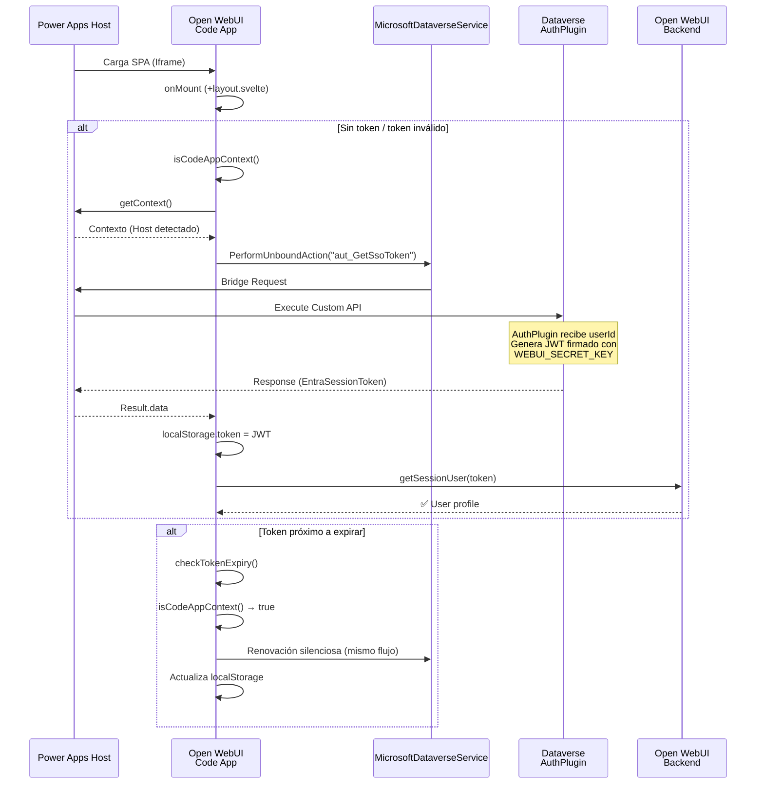

# CRM Auth Integration & Embedded Experience — Source of Truth

## Objetivo General
Crear un Asistente de Inteligencia artificial destinado a asistir orientadores vocacionales a orientar a los usuarios.
Actualmente el equipo de orientadores trabaja en Dynamics 365 CRM, donde tiene informacion historica del usuario (tabla 'contact' dataverse) 
Se busca integrar un widget de chat en el crm que permita al orientador hablar con el asistente directamente desde el crm.
El asistenten debe ser capaz de conocer en tiempo real la informacion del usuario que se esta entrevistando.
Para esto, estamos apoyandonos en un fork propio del proyecto Open Source Open-webui y buscamos integrarlo en un chat widget a Dynamics  365.

## Contexto del Proyecto
Realizamos un fork de Open WebUi en la carpeta src/web/open-webui
Inicializamos Power Apps Code App con pac code init en el repositorio.
Estamos trabajando en la integracion crm -> Open Web Ui.
Para embeber el chat en el crm, estamos utilizando la api de javascript de la model driven app, para crear un side Panel y navegar dentro de el a un webresource llamado iframe bridge.
Este iframe bridge recibe la url y la setea en un iframe.
Por ahora es su unica funcionalidad, pero se descubrioo que puede acceder a Xrm.Page a traves de parent.Xrm.Page, cosa que es bastante util ya el src de nuestro iframe es cross origin, y por otro lado el javascript de las model driven app se carga por formulario.
Estas 2 cosas hacen que nuestro iframe bridge sea muy coveniente para comunicarse con nuestro iframe via post message para funcionalidades futuras, ya que estara disponible en el contexto global de la app mientras viva el side panel.
Por ello, se crearon varios servicios junto con el js que abre el side panel.
Esto esta en powerapps/js/src
si bien el file hace referencia a contact command bar, como te digo actualemtne se esta usando para escribir boilerplate que necesitaremos.


# Features

## Feature 1: ContanctCommandBar.js 

**Descripción:**  
Cuando un usuario toca el boton de abrir chat en el crm, se ejecuta la funcion newChat() de ContactCommandBar.js
La misma navega al web resource que tiene el html con el iframe para mostrar el chat de open web ui, y la logica js para inyectar el contexto del crm.

### Implementación

**Estado:** Completo

**Detalle Técnico:**
```javascript
newChat() {
    const existingPane = this.paneService.getPane(this.CHAT_PANEL_NAME);
    if (existingPane) {
        console.log("Chat pane already open");
        existingPane.select();
        return;
    }

    this.paneService.createPane({
        title: "Chat",
        paneId: this.CHAT_PANEL_NAME,
        canClose: true,
        width: 400,
        alwaysRender: true,
    }).then(pane => {
        pane.navigate({
            pageType: "webresource",
            webresourceName: this.CHAT_BRIDGE_RESOURCE_NAME,
            data: JSON.stringify({
                url: this.CHAT_BASE_URL
            })
        });
    }).catch(error => {
        console.error("Error creating chat pane:", error);
        this.navigationService.openErrorDialog({
            message: "Error creating chat pane",
            details: error.message,
        });
    });
}
```

## Feature 2: Iframe Web resource carga el iframe de open-webui

**Descripción:**  
Este iframe tiene acceso al Xrm object de la api de cliente de js de model driven a partir de parent.Xrm
Ademas se encuentra en el mismo dominio de power apps.
ademas este webresource lo estamos cargando en un side panel, por ende esta disponible globalmente en toda la app
esto lo hace un lugar perfecto para controlar el chat e inyectar el contexto que necesitemos de la navegacion del usuario.
por el momento, solo nos encargamos de hacerlo seleccionar un contacto, de esta manera podemos manejar la gestion de carpetas para ese contacto, ademas 
de posteriormente inyectar contexto especifico en el backend


### Implementación

**Estado:** Completo

**Detalle Técnico:**
Al abrir el chat widget, se ejecuta la logica que extrae el contexto actual.
Si estamos en le formulario de contacto, el contact_id y contact_name se setean automaticamente como folder_id y name
Esto nos permite, no solo aislar los chats por usuario entrevistado, si no que posteriormente usaremos esta relacion folder -> contacto para inyectar info del contacto del crm directamente en el backend del llm.

```javascript
async initChat(url) {
    try {
        const Xrm = parent.Xrm;
        const pageContext = Xrm.Utility.getPageContext();
        const pageType = pageContext.input.pageType;
        const entityName = pageContext.input.entityName;
        console.log("CRM page context - pageType:", pageType, "entityName:", entityName);

        // If contact entity build url automatically
        if (pageType === "entityrecord" && entityName === 'contact') {
            const contactId = pageContext.input.entityId;
            const contactName = pageContext.input.entityName;
            console.log("Contact record context detected. ID:", contactId, "Name:", contactName);
            return this.buildChatUrl(url, contactId, contactName);
        }

        // Open lookup quick form
        const lookupResult = await Xrm.Utility.lookupObjects({
            entityTypes: ['contact'],
            defaultEntityType: 'contact',
            allowMultiSelect: false,
        });

        if (!lookupResult || lookupResult.length === 0) {
            await Xrm.Navigation.openAlertDialog({ text: "No se ha seleccionado un contacto, el bot no tiene la informacion del mismo." });
            return url;
        }

        // Get selected contact data and build folder_id and folder_name query params.
        const selectedContactId = lookupResult[0].id.replace(/[{}]/g, "");
        const selectedContactName = lookupResult[0].name;
        console.log("Selected contact ID:", selectedContactId, "Name:", selectedContactName);
        return this.buildChatUrl(url, selectedContactId, selectedContactName);
    } catch (e) {
        console.error("Error initiating chat with crm context")
        return url;
    }
}
```


## Feature 3: Autenticación Silenciosa en Power Apps Code Apps

**Descripción:**  
Cuando el frontend corre dentro de Power Apps, obtiene un JWT de Dataverse sin que el usuario vea una pantalla de login. Esto permite que la aplicación embebida herede la identidad del usuario de CRM.

### Implementación

**Estado:** Completo

**Archivos Principales:**
- `src/lib/powerapps/services/crmAuth.ts`
- `src/lib/powerapps/services/MicrosoftDataverseService.ts`
- `+layout.svelte`

**Detalle Técnico:**

1.  **Detección del Contexto (`isCodeAppContext`)**:
    Se utiliza el SDK `@microsoft/power-apps` (`getContext`) con un timeout para detectar si la app está corriendo dentro del player de Power Apps (iframe).

    ```typescript
    export async function isCodeAppContext(): Promise<boolean> {
        if (typeof window === 'undefined') return false;
        if (window === window.parent) return false;

        try {
            // Race condition: si no responde en 1s, asumimos que no es Code App
            const ctx = await Promise.race([
                getContext(),
                new Promise<null>((_, reject) => setTimeout(() => reject(new Error('Timeout')), 1000))
            ]);
            return !!ctx;
        } catch {
            return false;
        }
    }
    ```

2.  **Obtención del Token (`requestCrmToken`)**:
    Se invoca a la Custom API `aut_GetSsoToken` utilizando `MicrosoftDataverseService`.
    
    ```typescript
    const result = await MicrosoftDataverseService.PerformUnboundActionWithOrganization(
        CRM_BASE_URL, // Inyectado por Vite (define)
        CRM_CUSTOM_API_NAME // 'aut_GetSsoToken'
    );
    // El plugin retorna el token en la propiedad EntraSessionToken
    const entraToken = (data?.EntraSessionToken ?? data?.entraSessionToken);
    ```

3.  **Flujo en Frontend (`+layout.svelte`)**:
    - **Al iniciar (`onMount`)**: Si no hay sesión válida, se intenta `attemptCrmAuth()`.
    - **Sesión Activa**: `checkTokenExpiry` monitorea la validez del token.
    - **Renovación**: Si está por expirar y es contexto Code App, renueva el token silenciosamente.

**Arquitectura:**



**Configuración Requerida:**

*   **Frontend**: `.env` con `CRM_BASE_URL`.
*   **Backend**: `WEBUI_SECRET_KEY` (debe coincidir con Dataverse AuthPlugin) y `CORS_ALLOW_ORIGIN` (para incluir la URL del frontend).

---

## Feature 4: Gestión de Contexto (Carpetas por Registro)

**Descripción:**  
El frontend permite iniciar la aplicación en el contexto de una carpeta específica (por ejemplo, para separar chats, documentos o historial por cada registro/contacto de CRM).

### Implementación

**Estado:** Completo

**Archivos Principales:**
- `src/lib/powerapps/stores/crmContext.ts`
- `src/lib/powerapps/services/CrmContextService.ts`
- `src/lib/powerapps/components/CrmSidebar.svelte`
- `src/routes/(app)/+layout.svelte` (cambio menor: switch condicional de sidebar)
- `src/lib/components/chat/Chat.svelte` (cambio menor: guards de persistencia de folder)

**Detalle Técnico:**

1.  **Parámetros URL**:
    La aplicación escucha los siguientes query params:
    -   **`folder_id`** (Requerido): ID único de la carpeta (ej. GUID del registro de CRM).
    -   **`folder_name`** (Opcional): Nombre visible de la carpeta.

2.  **Lógica de Creación/Selección**:
    -   **Validación**: Si no existe `folder_id` en la URL, se ignora el contexto.
    -   **Búsqueda**: Se busca en Open WebUI una carpeta existente con ese ID exacto.
    -   **Creación**: Si no existe, se crea una nueva carpeta forzando el `id` al valor de `folder_id`. Si no se provee nombre, se usa el ID como fallback.

**Ejemplo de Integración en Power Apps:**
```
https://apps.powerapps.com/...
  ?_localAppUrl=http%3A%2F%2Flocalhost%3A5173%3Ffolder_id%3D<GUID>%26folder_name%3D<NAME>
```


### Sidebar CRM (Folder-Scoped)

**Problema resuelto:** Al embeber Open WebUI en CRM, la sidebar mostraba todos los chats, carpetas, channels, workspace, etc. El usuario no tenia claro a que contacto apuntaba el chat.

**Decision de arquitectura:** Se creo una sidebar alternativa (`CrmSidebar.svelte`) en lugar de agregar condicionales en la sidebar existente (1458 lineas). Esto mantiene `Sidebar.svelte` intacto (0 cambios), minimiza conflictos con upstream, y permite agregar features CRM-specific sin tocar codigo del fork.

**Componentes:**

1.  **Store permanente (`src/lib/powerapps/stores/crmContext.ts`)**:
    Store generico extensible para el contexto CRM. Se setea una vez al inicializar y nunca se limpia durante la sesion. A diferencia de `selectedFolder` (que se limpia al crear chats), `crmContext` persiste para toda la vida del iframe.

    ```typescript
    export interface CrmContext {
        folder: CrmFolderContext;  // { folderId, folderName }
        // Extensible: entityType, entityId, metadata, etc.
    }

    export const crmContext = writable<CrmContext | null>(null);
    export const isCrmEmbedded = derived(crmContext, ($ctx) => $ctx !== null);
    ```

2.  **CrmContextService setea el store**:
    Despues de resolver/crear la carpeta, `CrmContextService.initCrmContext()` setea `crmContext`:

    ```typescript
    if (targetFolderId) {
        crmContext.set({
            folder: { folderId: targetFolderId, folderName: displayName }
        });
    }
    ```

3.  **CrmSidebar (`src/lib/powerapps/components/CrmSidebar.svelte`)**:
    Sidebar simplificada que muestra unicamente:
    -   Header con nombre del contacto (folder name).
    -   Boton "New Chat" que preserva el folder context (NO limpia `selectedFolder`).
    -   Lista de chats de la carpeta (usa `getChatListByFolderId` existente).
    -   User menu al fondo.
    -   Soporte mobile (overlay, touch gestures), resize handle, collapsed state.

    Reutiliza componentes existentes sin modificarlos: `ChatItem.svelte`, `UserMenu.svelte`, `Spinner`, `Loader`, iconos.

    NO incluye: Search, Notes, Workspace, Channels, Pinned Models, Folders accordion, Pinned chats, drag/drop, folder/channel creation modals, archived chats modal.

4.  **Switch condicional en layout (`src/routes/(app)/+layout.svelte`)**:
    ```svelte
    {#if $isCrmEmbedded}
        <CrmSidebar />
    {:else}
        <Sidebar />
    {/if}
    ```

5.  **Guards en Chat.svelte (`src/lib/components/chat/Chat.svelte`)**:
    -   `selectedFolder.set(null)` despues de crear un chat se guarda con `if (!$crmContext)` para no perder el contexto CRM.
    -   Al re-montar Chat.svelte (navegacion a `/` para nuevo chat), si la URL no tiene query params pero `crmContext` persiste, se re-aplica el `selectedFolder` desde el store permanente.

**Flujo completo:**
```
1. Usuario abre chat desde CRM → side panel → iframe bridge → Open WebUI con ?folder_id=<GUID>&folder_name=<Nombre>
2. CrmContextService crea/encuentra carpeta → setea selectedFolder + crmContext (permanente)
3. isCrmEmbedded = true → se renderiza CrmSidebar en lugar de Sidebar
4. CrmSidebar muestra solo chats de esa carpeta
5. "New Chat" → navega a / → Chat.svelte re-mount → crmContext persiste → selectedFolder se re-aplica → chat se crea en la carpeta correcta
6. CrmSidebar refresca la lista de chats
```

---

